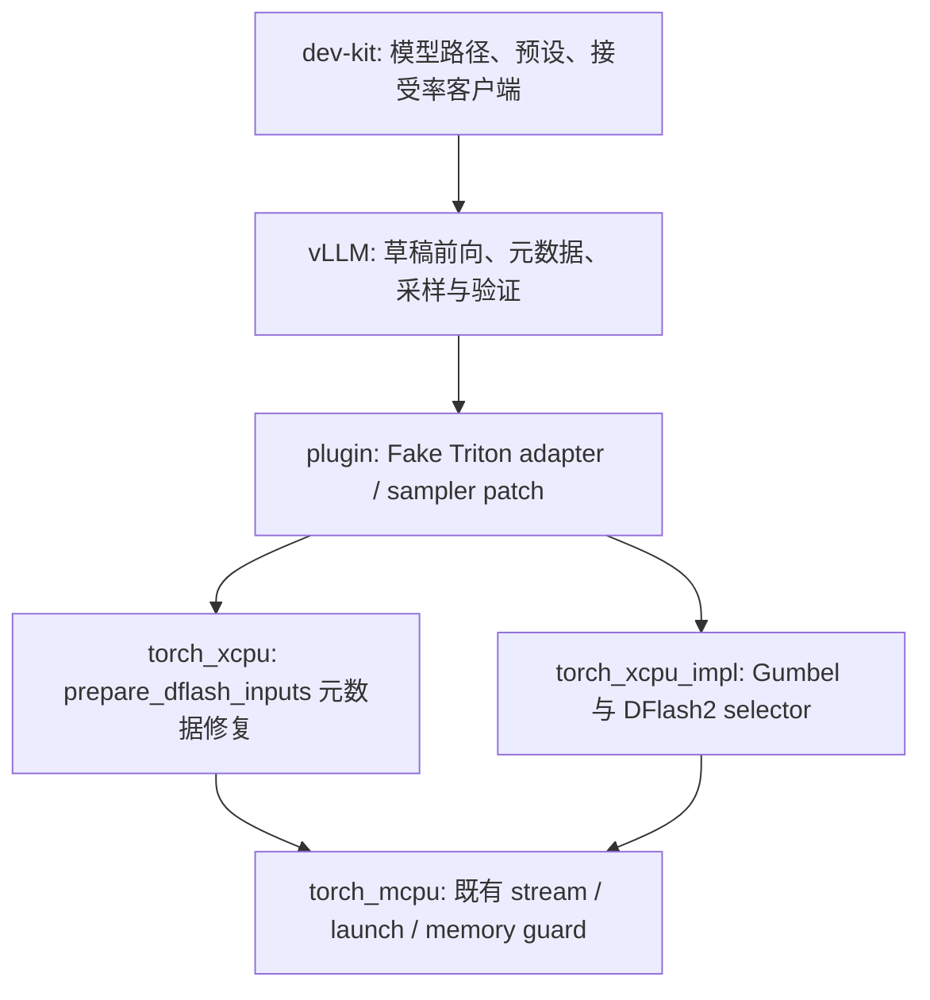

# GLM-5.2-MXFP4 DFlash / DFlash2 回移与跨仓影响

本次改动解决了三个不同的问题：草稿 KV 元数据的边界错误、概率草稿采样的随机流与 selector 支持、上游回移后 XCPU 插件的接口对应关系。**torch_xcpu 的修改包含通用采样算子，影响范围超过 GLM；不能作为一个仅增加启动预设的改动理解。**

截至 2026-10-01，plugin 已整理成单提交 `188b1a5`；torch_xcpu 已提交为 `117a637`，包含 KV 边界修复、独立草稿采样、selector、CPU 测试同步分支撤回、来源注释及请求级 OpenMP 并行，工作区干净。**本文当前已提交范围为 vLLM、plugin 和 torch_xcpu；dev-kit 的预设、测试客户端及文档更新已退回暂存区，按用户要求不纳入已提交功能范围，也不改动其暂存状态。** 历史模型测试仍保留为证据。`status: completed` 表示本日志更新完成，不表示模型回答质量全部达标。

## 1. 背景及分析

### 1.1 用户需求与模型契约

目标是给已有 GLM-5.2-MXFP4 部署增加两个本地草稿，并检查每个草稿位置的接受率及回答合理性。随后要求参考 `/shared/vllm` 回移较新提交。本地参考仓库快照为 `9b2f34cad446f73b1699e8236ec0b611a65f48af`；本次开发基线 vLLM 为 `74119a7bc44f384e5aec07966b7974cbbb92d10b`。

| 配置 | GLM-5.2 DFlash | GLM-5.3 DFlash2 |
| --- | --- | --- |
| 本地 ModelScope 模型目录 | `UCloud-AILab--GLM-5.2-FP8-DFlash/snapshots/master` | `incoai--GLM-5.3-DFlash2/snapshots/master` |
| 草稿架构 / 层数 | `DFlashDraftModel` / 5 | `DFlash2DraftModel` / 6 |
| hidden size / vocab size | 6144 / 154880 | 6144 / 154880 |
| 训练 block size / 本次草稿 token 数 | 16 / 5 | 8 / 5 |
| 读取目标层号（模型配置中的编号） | `[1,20,38,56,75]` | `[5,19,33,47,61,75]` |
| 草稿 KV / 额外结构 | BF16 | BF16；SWA=2048；conv kernel=2；selector rank=256、TopK=16 |

模型目录均位于 `~/.cache/modelscope/models/`。目标是本地 Hugging Face 缓存的 `amd/GLM-5.2-MXFP4`，78 层；XCPU 实际使用 W4A16 路径，目标 MLA KV 为 FP8。不能将本次结果写成原生 W4A4 NPU 结果。

两个草稿与目标的 hidden size、词表大小及目标层索引范围相容。GLM-5.3 DFlash2 是跨目标模型使用，训练匹配程度需要由接受率评估；本次没有改权重或绕过架构校验。配置层号进入 vLLM 辅助 hidden-state capture 时已有 `+1` 转换，该机制不是本次新实现。

### 1.2 原分支已有能力与实际缺口

原分支已有 DFlash2 架构注册、selector 调用、分组卷积以及 grouped KV 准备路径。增加 GLM 预设即可进入这些路径，但原有实现不足以覆盖较新上游的边界和概率采样契约。

| 问题 | 证据与原行为 | 为什么需要修改 |
| --- | --- | --- |
| 被拒绝的上下文后缀仍产生有效 KV slot | CPU/MCPU 边界复现中，拒绝 2 行后仍得到 `[30,31,32,33]`，预期 `[30,31,-1,-1]` | 下轮草稿不应把已经被拒绝的行写回缓存 |
| 空块 0 被作为可写块 | 已淘汰的 SWA 行及 query 可产生 block 0 内的 slot | 物理块 0 是 null block，必须输出 `PAD_SLOT_ID=-1` |
| 草稿 seq_len 超过模型边界 | `max_model_len=128` 的近边界复现输出 130 | 元数据长度需要限制在模型边界内；不能仅依靠 query position clamp |
| SWA 与目标块大小不匹配 | XCPU backend 声明 `MultipleOf(16)`，旧选择返回 16，目标块为 64 | 混合 MLA/indexer/SWA 缓存的块大小及调度 LCM 需要一致处理 |
| DFlash2 概率 selector 被插件拒绝 | adapter 明确拒绝 `SAMPLE_PROBABILISTIC=True` | 较新上游允许概率草稿，XCPU 需要真正实现候选概率采样 |
| 草稿与目标共享随机噪声键 | 旧草稿采样使用与目标相关联的位置/seed 流 | 上游概率比率验证要求草稿 proposal 与目标 residual sampling 使用分离的噪声流 |
| 显式 V1 配置绕过 DFlash2 默认 V2 选择 | 设置 `VLLM_USE_V2_MODEL_RUNNER=0` 可以进入不支持 selector 的 runner | 需要在配置阶段明确拒绝 |

原始边界复现见[历史审计](../../vllm_scripts/logs/glm52_dflash2_upstream_audit_20260930.json)及其引用的原始结果。历史审计记录的是修复前状态；修复后的结果见[回移验证记录](../../vllm_scripts/logs/glm52_dflash_backports_20260930.json)。

### 1.3 跨仓调用关系



只改 vLLM 的 Triton 源码不会自动修复 XCPU：运行时会被 plugin 替换为已有 C++ 实现。只更新 plugin 的 fingerprint 也不能代替对应行为实现。因此采样接口、KV 边界以及兼容性检查必须一起处理。本次没有为此修改 torch_mcpu 或 torch_mpi_ext 源码。

## 2. 方案及效果评估

### 2.1 torch_xcpu：为什么要改、具体改了什么

本仓提交 `117a6379378b72531a9033299114b5125af1bdd0`（`[DFlash2] adapt dflash2 from vLLM v0.28 to support GLM-5.3-DFlash2`）包含 17 个变更文件，基于 `c497e76`，共 +420 / -60 行。下述 A/B/D 功能及 C 的测试生命周期修正均已包含在该提交中；完整文件清单在附录。

**A. 修复 `prepare_dflash_inputs` 的三个边界。**

[prepare_dflash_inputs.hpp](../../torch_xcpu/torch_xcpu/include/prepare_dflash_inputs.hpp) 为拒绝后缀输出 position=0、slot=-1；context/query 的 block ID 为 0 时输出 slot=-1；输出 seq_len 使用 `min(..., max_model_len)`。有效行继续按各 KV group 自己的 block size / block table 生成 slot，保留本项目已有的多组元数据实现。

这是元数据准备操作，改动保留在既有 wrapper 层，不新增大型数值 kernel。slot=-1 的含义是“跳过 KV 写入”，不是写零。前向中仍存在这些行的存储布局，不能随意删行，否则 context/query/sample 索引会失去对应关系。

测试不仅更新 Python reference，还加入 CPU/MCPU 的三个独立预期断言：拒绝后缀、null block、近最大长度。这样可以避免“实现和参考一起写错却互相一致”。这些修复同样服务 DFlash 与 DFlash2。

**B. 通用 Gumbel sampler 增加草稿随机流标记。**

`torch_xcpu.ops.gumbel_sample` 的 Python wrapper、fake callback、C++ schema、参数结构和底层实现增加 `is_drafting`。Torch schema 将它追加到参数末尾并给默认值 `False`，现有 Torch 调用不提供该参数时仍走目标流。C++ 内部函数签名改变，需重新编译扩展，不能仅替换 Python 文件。

已有 counter RNG 的 seed/position/token-ID 混合算法抽取为 [gumbel_rng.h](../../torch_xcpu/torch_xcpu_impl/include/gumbel_rng.h)，普通 sampler 和新 selector 共用。草稿 position 加 `1<<30`，目标不加。**没有把 XCPU 的随机算法改成上游 Triton 的 Philox；本次移植的是流分离语义，不是跨后端逐 token 随机结果一致性。**

在相同 seed、位置和 token-ID 下，非零温度的草稿 draw 会改变；目标 `is_drafting=False` 保留原算法。温度为零不加随机扰动。本次 CPU/MCPU FP32/FP64 测试验证：草稿 draw 等于显式盐化位置的目标 draw，且与未盐化目标 draw 不同。它不是完整的概率分布证明。

**C. 撤回仅供 CPU 测试使用的同步分支（2026-10-01）。**

核对真实调用点后，`sampler_patch.py::_patched_gumbel_sample` 仅在 logits 为 `mcpu/privateuseone` 时进入 XCPU sampler；CPU logits 调用原 sampler。之前新增的 `if (!is_mcpu)` 同步分支只为 CPU 单元测试服务，没有真实模型调用点，因此按用户要求删除，并从 wrapper、实现声明及模板实例化中移除 `is_mcpu` 参数。

CPU 注册入口是本次开发之前已有的接口，继续保留原有 MCPU launch 路径，不为测试增加另一套生产执行分支。新增测试将 `logits.clone()` 保存在局部变量中，并在同步完成后才返回，保证异步任务使用的 CPU Tensor owner 存活。真实 MCPU 模型的 launch、随机流和输出行为保持原实现；共享 workspace 的多 stream 完整验证仍不在本次范围。

**D. 将 DFlash2 selector 的本次调用迁到 torch_xcpu_impl。**

plugin 原来调用 `torch.ops.mcpu.vllm_dflash2_selector_walk`，该路径只支持 greedy。本次新增 `torch.ops.torch_xcpu.dflash2_selector_walk`；公共 wrapper 负责 dtype/layout/device 检查，实际遍历在 [dflash2_selector_walk.cpp](../../torch_xcpu/torch_xcpu_impl/src/dflash2_selector_walk.cpp)。旧 MCPU 算子没有删除，其他调用者仍可使用它。

原 kernel 来源为 `vllm/vllm/v1/worker/gpu/spec_decode/dflash2/speculator.py::_selector_walk_kernel`，采样辅助为 `vllm/vllm/v1/worker/gpu/sample/gumbel.py::gumbel_noised_argmax`；先前 greedy-only 移植位于 `torch_mcpu/csrc/aten/vllm_kernels/selector_walk.cpp::vllm_dflash2_selector_walk_impl`（路径相对 dev-kit 根目录）。新实现文件顶部已注明这三处来源、草稿随机流上游提交及 XCPU RNG 差异。

对每个请求、每个草稿步骤，selector 根据上一阶段选中的候选列选取当前分数行，再选择候选 token。概率模式使用：

```text
argmax_k(score[k] / temperature + G(seed, predicted_position - 1 + 2^30, candidate_token_id[k]))
```

noise 键是候选 token ID，不是 TopK 内部列号。`realized_scores` 保存选中转移行的原始 logits，供后续 proposal / rejection 处理；不能存入已加噪的分数。温度为零或 greedy 模式使用 argmax；state<0 的 padding 请求不写输出。

实现增加独立 `OperatorId::DFlash2SelectorWalk` 和 A0/B0 入口；A0 实现实际计算，B0 为占位。TopK=2/4/8/16/32/64/128、概率模式和 FP32/FP64 在 launch 外模板分派，其他 TopK 用通用实现。launch 捕获原始指针和标量参数结构，CPU 直接执行，MCPU 异步执行。

请求维度的外层循环增加 `omp parallel for schedule(static)`，单请求用 `if (args.num_requests > 1)` 避免启动并行 team。各请求只写自己的 token / realized score 区域，seed、previous 和局部采样变量独立；请求内草稿步骤依赖上一候选，保持顺序执行。Release 重编安装通过；`OMP_NUM_THREADS=1` 和 `4`、`OMP_DYNAMIC=false` 各运行现有 selector 回归 **2 passed**，覆盖 greedy K2、概率 K16、FP32/FP64、温度零和 padding。该验证证明结果一致，不提供性能加速结论；日志在 [selector OMP checks](../../vllm_scripts/logs/glm52_dflash2_selector_omp_checks/)。

这一拆分让 NPU 算子团队能替换 selector 的主路径，不必在 plugin 中维护数值计算。静态 TopK 增加模板实例及构建成本；本次没有证明它提高吞吐。默认 A0 是可执行版本，不能把占位 B0 当成已实现的替代路径。

### 2.2 vllm-xcpu-plugin：适配作用与范围

当前单提交为 `188b1a5950a72cf1d5759544a1101a61847bc95b`，标题为 `[DFlash] adapt XCPU sampling and KV preparation to upstream fixes`。

| 文件 | 行为与必要性 | 影响 |
| --- | --- | --- |
| `vllm_xcpu_plugin/sampler_patch.py` | 将 vLLM 新增的 `is_drafting` 传给 XCPU sampler；非 XCPU fallback 同样按新签名调用 | 是采样接口适配，适用于使用该 patch 的其他模型，不能只按 GLM 判断 |
| `vllm_xcpu_plugin/fake_triton/vllm_kernels.py` | selector 转接新 XCPU 算子；autoregressive decode/update 单独推进 `sample_src_positions` | RNG 位置推进独立于 RoPE position clamp/冻结；最后一步不再推进；增加少量设备 tensor 更新操作 |
| 同上 | 更新已审阅的 autoregressive、resample、selector kernel fingerprints | 上游接口变更必须重新检查；未关闭兼容性保护 |
| `vllm_xcpu_plugin/upstream_compatibility.py` | 更新 Gumbel fingerprints，并增加 DFlash prepare kernel guard | 避免 vLLM 已变更而旧 XCPU prepare 实现仍静默运行；未来源码更新可能触发预期的拒绝 |
| `tests/fake_triton/test_dflash2.py` | greedy K2 及真实 GLM TopK=16 概率路径与稠密候选采样比对 | 覆盖 FP32/FP64、温度零和 padding 行 |
| `tests/fake_triton/test_v2_model_state.py` | 独立 sampling position 推进测试 | 覆盖 `ADVANCE_DRAFT_POSITIONS=False` 和最后一步不推进 |

**提交整理仅改变历史，没有改变代码树。** 原来的 `e6d09ec`、`8992836`、`3814936` 三个提交由新单提交覆盖；新提交 tree 与原 `3814936` tree 完全相同。提交 hook 的 Python lint 和 72 个源文件 mypy 检查通过。

### 2.3 vLLM：回移内容与 `attention.py` 修改理由

`attention.py` 的修改不是 GLM 模型计算公式，也不是把 SWA 改成 full attention。它处理 **KV spec 的块大小选择**：后端支持 `MultipleOf(16)` 表示可运行 16 的倍数，不代表只能选 16。上游修复按 page budget 选择最大的可用对齐块；没有共享 padded page 时以主块大小计算预算。因此本次真实 XCPU 配置的草稿块选择为 64，匹配目标块 64。混合缓存回归使用真实 `MultipleOf(16)` 声明，覆盖 hybrid manager 开关两种配置。

原临时“禁用 hybrid 时直接强制主块”方案已被该上游通用选择逻辑替代。DFlash2 预设仍保留 `--disable-hybrid-kv-cache-manager`：这是混合 MLA/indexer/draft page 分配的当前约束，SWA=2048 的注意力窗口仍保留。这两件事不能混为一谈。

| 本地提交 | 改动原因 / 行为 | 移植限制或副作用 |
| --- | --- | --- |
| `5d351ec675` | SWA 块选择修复；增加启动时 KV group size / LCM 日志 | 通用 attention 配置改动，其他混合缓存模型也可能改变分配块大小；不是速度测量结论 |
| `88845f4907` | speculators 格式新增 DFlash2 转换器，保留 conv/selector 字段；runtime method 映射为 `dflash` | 两个给定模型是 raw config，本次运行并不依赖该转换器；另做真实 metadata roundtrip 检查 |
| `2a0ff7738b` | 对 windowed DFlash 的 FlashAttention builder 关闭错误的 AOT schedule | 非 XCPU 路径也会触达该逻辑；本次没有 GPU FlashAttention 运行验收 |
| `584170350c` | eager/PIECEWISE metadata 用实际 query token 数；FULL 使用捕获的 padding 形状；重构 shared metadata builder | 保留本地 packed auxiliary 状态；未移植缺失的 CP、多模块 MTP/fused decode；DP padding 单测通过，不等于分布式端到端通过 |
| `602aa21bc6` | Gumbel 接口新增草稿标记、独立噪声流及 sampling source position；目标/resample 明确用目标流 | 影响共享 sampler、autoregressive、DFlash2、DSpark；DSpark 旧 cache 参数名同步修正，但未做 DSpark 模型运行 |
| `6e1414d290` | 草稿 attention 的 RoPE layout 从草稿自身 `is_neox_style` 读取，默认 True | 给定模型使用默认 True；非默认 layout 可以改变计算；原分支本来没有 target-layout 推断函数，未机械移植删除不存在函数的部分 |
| `b998859f58` | DFlash Triton prepare 同步拒绝后缀/null block masking、长度 clamp；sample mapping 初始化 -1 | 只回移 DFlash 部分，未带入无关 DeepSeek-V4 改动；XCPU 修复必须与其对应 |
| `b2cb56570f` | 显式 V1 遇到 DFlash2 / mixed sliding-full DFlash 时拒绝；target layer count 用总层数；增加真实混合缓存回归 | 保留平台 runner 默认；总层数修复不代表 PP relay/GLM PP 支持已实现 |
| `b3da1aa492` | 配置拒绝和 DP metadata padding 回归测试 | 不增加新的模型计算路径 |

### 2.4 历史 dev-kit 运行配置与检查客户端（当前暂存，忽略本轮更新）

2026-09-30 的历史测试使用两个 MXFP4 `_5.sh` 预设及 [test_dflash_acceptance.py](../../vllm_scripts/serve_test/test_dflash_acceptance.py)，当时记录在 `be6975a`。该 dev-kit 更新已从当前分支退回暂存区，`be6975a` 不再作为当前生效提交引用；现有暂存区的其他预设扩展也不在本次文档更新的审阅或验收范围。以下仅说明历史测试使用的配置：继承已有 GLM sparse attention / FP8 目标缓存配置，草稿 KV 使用 `auto`（本模型为 BF16），因为 grouped cache 写入没有草稿 FP8 destination / scale 支持。

历史预设默认 `draft_sample_method=greedy`，可用 `USER_VLLM_DFLASH_SAMPLE_METHOD=probabilistic` 覆盖；DFlash2 历史模型运行专门验证了 probabilistic draft。DFlash 端到端使用 greedy draft；温度 0.7 指目标 sampling temperature，不能称其为“DFlash 概率草稿端到端已验收”。

检查客户端在请求前后读取 Prometheus counter 差值，检查 5 个位置 prefix count 非负、单调及其总和等于 accepted total；另报告条件接受率。数学检查取数值答案，代码检查执行 GCD 边界与 merge 不修改输入等用例。KV 解释的语义仍须人工审阅；其长度标记统计包含 Markdown 的 raw characters。客户端没有将 KV 语义或超长标记自动转换为整套测试失败，不能只根据客户端退出码判断回答全部合理。

### 2.5 已有验证结果与当前提交的对应范围

2026-09-30 的 scoped real-model 运行共 7 组、37 个完成回答，覆盖单并发、双并发、目标温度 0/0.7；DFlash2 另覆盖 3484 prompt tokens 的长上下文。下表均为双并发、5 个草稿 token；“第 N 位”是该位置接受 prefix 数 / 草稿轮数。

| 草稿 / 采样配置 | 轮数 | 第1位 | 第2位 | 第3位 | 第4位 | 第5位 | 每轮输出 token 数（含目标 bonus/recovery） |
| --- | ---: | ---: | ---: | ---: | ---: | ---: | ---: |
| DFlash，greedy draft，目标 T=0 | 259 | 64.48% | 39.00% | 25.87% | 19.69% | 13.51% | 2.63 |
| DFlash2，probabilistic draft，目标 T=0 | 212 | 80.19% | 63.68% | 54.25% | 41.98% | 36.79% | 3.77 |
| DFlash，greedy draft，目标 T=0.7 | 244 | 60.25% | 36.89% | 25.41% | 19.26% | 15.98% | 2.58 |
| DFlash2，probabilistic draft，目标 T=0.7 | 186 | 76.34% | 58.06% | 44.09% | 33.87% | 28.49% | 3.41 |

所有位置有非零接受且计数一致，没有观察到接受率塌陷。**这不是通用“正常接受率”阈值，也不能将每轮接受长度直接当成吞吐加速比。** 目标温度 0 的 DFlash2 两组结果与回移前对应单/双并发运行的 12 个回答及全部接受计数一致。

19 个数值答案及 54 个代码边界检查通过。但 6 个 KV 回答均超过 200 raw characters；DFlash T=0.7 错误声称内存可能指数增长，DFlash2 T=0.7 错误声称每个 KV 向量维度随层数增长。长上下文计算结果 1279 正确，但严格末行格式检查失败，提示词字面要求“答案：整数”也有歧义。因此回答质量不能报告为全部通过。

| 检查 | 结果 | 证据 / 范围 |
| --- | --- | --- |
| prepare + draft noise CPU/MCPU | 118 passed | 含拒绝/null/长度独立断言；不局限于 GLM 字符串筛选 |
| Gumbel temperature/cache/padding | 26 passed | CPU/MCPU；与上一组有重叠，不能相加成唯一测试总数 |
| plugin selector / guard | 9 passed | 原回移组合 |
| 独立 autoregressive sampling key | 1 passed | adapter 的状态更新路径 |
| 最终 TopK=16 selector / K2 回归 | 2 passed | 最终已安装的静态 TopK 实现，FP32/FP64、零温度、padding |
| vLLM final block/padding/config | 10 passed | 另有混合缓存回归与配置检查日志，存在交叉覆盖 |
| draft causality | 13 passed | 给定 DFlash2 windowed noncausal 行为 |
| upstream compatibility targets | 44 个全部通过 | fingerprint 保护仍启用 |
| speculators metadata roundtrip | passed | 真实 GLM-5.3 DFlash2 metadata；运行时 method=dflash |
| KV cache utils 整套 | 68 passed / 4 failed | 四个失败已在修改前方法复现，仍保留；不是全套绿灯 |
| release 构建、安装 | passed | implementation 静态库和扩展均完成 |

证据集中在 [backport checks](../../vllm_scripts/logs/glm52_dflash_backport_checks/)，完整计数、模型回答、source/local commit 映射见[验证 JSON](../../vllm_scripts/logs/glm52_dflash_backports_20260930.json)。其中 repository SHA 与整理状态字段包含历史快照；当前涉及提交以本文 front matter 为准。

**模型与算子验证需分开理解。** 2026-09-30 的 37 个模型回答先于最终 TopK 静态化、CPU 同步分支撤回和 OpenMP 修改。后续 release 重编及 28 项 CPU/MCPU 采样回归、K2/K16 selector 回归、OMP 1/4 线程检查针对这些最终实现；相关代码现已包含在 `117a637`。没有对该最终提交再次加载大型模型，也没有把 dev-kit 新增暂存预设视为已运行。此次仅核对提交和更新文档，未新增运行验收结论。

## 3. 影响及约束

### 3.1 部署与兼容性

1. **必须按组合升级。** 当前 plugin 要求 vLLM 的新采样签名和 XCPU 的新 selector / `is_drafting` 支持。只取 plugin 单提交配旧 XCPU，会遇到缺少算子或参数不兼容；只更新 fingerprint 配旧 kernel 会漏掉行为修复。vLLM 的直接外部 sampler 调用也需要显式提供 `is_drafting`。
2. **非零温度草稿输出的可复现性改变。** salt 修复有意改变 proposal 随机序列；同一个 seed 与旧版草稿结果不能要求完全相同。目标流算法本身保持 XCPU 既有 counter RNG，不保证与 CUDA 逐位一致。
3. **影响其他模型路径。** shared Gumbel sampler、autoregressive 状态以及 SWA block selector 是通用代码。代码层测试覆盖了部分 shared 行为，真实模型验收仅针对本文两个 GLM 草稿；未运行所有 EAGLE/MTP/DSpark/其他 SWA 模型。
4. **缓存容量可能变化。** SWA block size 和 scheduler LCM 改变会影响页数量、padding 和可容纳请求；本次证据是可启动、正确计数与回答检查，没有统一容量/吞吐对比。新增 group/LCM 日志只在配置解析时输出，便于诊断。
5. **已验收范围为 DP1/TP1/PP1 eager。** 模型启动使用 max batched tokens=256、max seqs=2。Compile/FULL graph、实际 DP/TP/PP/CP、GPU FlashAttention 和真实 NPU 未做端到端验证。FULL/PIECEWISE 单元测试不等于图捕获验收。
6. **草稿缓存仍为 BF16。** 目标 FP8 KV 不意味着草稿 FP8 KV 已支持；禁用 hybrid manager 也不意味着 SWA 被禁用。

### 3.2 当前仓库状态与已安装二进制

torch_xcpu 的 `dev/0.25` 已提交 `117a637`，17 个功能/测试文件均在该提交中，工作区干净；从该提交的干净 checkout 可以构建本文描述的实现。较早的 `c497e76` 暂存状态只保留在历史备份，不能再用来描述当前源码。

plugin 对应 `188b1a5`，vLLM 对应 front matter 列出的回移提交。dev-kit 当前分支不包含原 `be6975a` 更新，运行文件和文档保留为暂存/工作区内容；本次只更新本文工作区文件，不执行提交、重置或暂存操作。独立 MoE 调试代码不在 `117a637` 的 17 个变更文件内。

CPU 同步分支撤回及 OMP 修改之后已有 release 构建/安装和算子回归记录。Git 提交或 dev-kit 历史回退本身不会重新安装或卸载扩展；本次文档更新不改变运行环境。

### 3.3 已知剩余问题

整套 KV utils 的既有失败为 `test_get_kv_cache_config_one_worker`、`test_unify_kv_cache_page_size_uses_padding_for_non_divisible_sizes`、`test_unify_kv_cache_page_size_padding_requires_backend_support`、`test_unify_kv_cache_spec_page_size_mamba`。基线复现见 [existing failures log](../../vllm_scripts/logs/glm52_kv_cache_existing_failures.log)，本次未修复这些独立问题。

概率 selector 的公开入口检查 dtype、device、连续性和 buffer 数量；请求 state 值、候选 ID 与位置的合法范围仍是上层调用契约。padding=-1 跳过写入，要求输出缓冲初始化或保持不会消费的契约。B0 仍为占位，部署保持默认 A0。构建/小范围测试通过不能替代内存保护 ON、多 stream 或真实 NPU 的安全性验证。

## 4. 后续开发

### 4.1 当前代码审阅与部署验收

后续审阅固定到 torch_xcpu `117a637`、plugin `188b1a5` 及本文列出的 vLLM 回移提交，重点检查通用 Gumbel 接口、KV masking 和 selector 并行；C 中仅供测试的 CPU 同步支持已撤回并包含在正式提交中。扩大部署范围时再补相应端到端验收，不能由已有单元测试推断全部部署模式都已支持。

下一轮模型质量检查需要更多确定性问题和语义评分，区分目标模型原有措辞问题与投机引入的偏差。若评估性能，需用统一 prompt/output/batch 条件比较 target-only 与两个草稿的延迟和吞吐。当前接受率证据不承担性能结论。

若扩大到 compile、PP/CP 或草稿 FP8 KV，应分别补实现和验收：图内临时缓冲/参数生命周期、跨 rank auxiliary hidden-state relay、多缓存 page stride、FP8 destination/scales 等。本次仅回移总层数计算，不宣称已有完整 PP 支持。

### 4.2 真实 NPU Infra / 算子团队需要做什么

- 在 `torch_xcpu_impl` 的 selector A/B 入口替换 x86 reference，保留上一候选决定下一分数行的顺序依赖、token-ID noise 键、`P-1 + 2^30`、原始 realized logits 和 padding=-1 语义。对 TopK=16 的真实模型形状验证，不只用 K2 合成样例。
- 在 NPU 的 dense sampler 与 selector 中使用一致的 counter/RNG 定义，并保留目标/草稿流分离。若替换随机算法，应记录与既有 XCPU、CUDA 的复现差异并做统计分布及 rejection 联合验证；仅比较 salted draw 不足以证明分布正确。
- 实现/复用异步 launch、pointer guard 和持久 buffer 生命周期；类型、TopK、精度在 host 侧选择，不能在设备任务中捕获临时 Tensor owner。检查 shared sampler workspace 在多 stream 下的隔离或序列化需求。
- 将 metadata preparation 的多 group slot 逻辑移植到真实设备，并验证 rejected/null/窗口淘汰/最大长度交叉场景；该 header 的 x86 元数据循环不能直接作为 NPU 性能实现交付。不要将 null block 0 解释为可写 cache。
- 对 BF16 grouped draft KV 写入与目标 FP8 MLA/indexer page layout 联合验收；若开启 hybrid manager 或草稿 FP8 KV，先补实际 padded page stride、量化 scale 及写入能力，再取消预设限制。
- 运行内存保护 ON 的 debug、保护 OFF 的常规性能、交错 prefill/decode、多 stream、图捕获、目标 baseline 及非零温度联合验收。B0 只有占位，不能直接启用作为 NPU 实现。

## 5. 附录

### 5.1 上游来源与本地回移边界

以下 source 均来自本地 `/shared/vllm`，不是对整个较新版本的整体升级。完整 SHA 见验证 JSON；PR 编号用于标识 source commit 记录。

| Source commit / PR | 本地提交 | 回移范围 |
| --- | --- | --- |
| `d29c88f162` / #53007 | `5d351ec675` | SWA page-budget/primary-block 主逻辑完整回移；本地另外保留 group/LCM 诊断日志 |
| `f79a2f5582` / #53797 | `88845f4907` | DFlash2 speculators 转换器完整回移 |
| `5093e4844a` / #54374 | `2a0ff7738b` | windowed draft 的 FlashAttention AOT schedule 修复完整回移 |
| `9dcf6bf344` / #56181 | `584170350c` | 适配 shared metadata/DP padding；省略本分支缺失的多模块 MTP、CP、fused decode |
| `fe755c8899` / #54282 | `602aa21bc6` | 适配独立草稿 Gumbel 与 sampling position；保留本地 CPU 快路径，省略不存在模块 |
| `fcc8647b13` / #54373 | `6e1414d290` | 仅回移 draft config 的 RoPE layout 参数传递 |
| `97388c44f9` / #51538 | `b998859f58` | 仅 DFlash rejected/null masking；省略 DeepSeek-V4 |
| `7f7a32cfec` / #47808 | `b998859f58` | 仅 seq_len clamp |
| `4aab2b0ebe` / #53183 | `b2cb56570f` | 仅 DFlash2/mixed-SWA V1 guard；保留平台默认 runner |
| `d87a440f88` / #50514 | `b2cb56570f` | 仅 total target layer count；不回移完整 PP |

### 5.2 变更文件索引

torch_xcpu 提交 `117a637` 的 17 个变更文件：

| 分组 | 文件（相对 torch_xcpu 仓库） |
| --- | --- |
| KV metadata + 测试 | `torch_xcpu/include/prepare_dflash_inputs.hpp`；`test/ops/custom_ops/test_prepare_dflash_inputs.py` |
| sampler schema / wrapper / fake | `torch_xcpu/csrc/gumbel_sample.cpp`；`torch_xcpu/include/gumbel_sample.hpp`；`torch_xcpu/ops_defs/gumbel.py` |
| sampler impl / RNG / 测试 | `torch_xcpu_impl/include/gumbel_sample.h`；`torch_xcpu_impl/include/gumbel_rng.h`；`torch_xcpu_impl/src/gumbel_sample.cpp`；`torch_xcpu_impl/src/xthd/gumbel_sample.cpp`；`test/ops/custom_ops/test_gumbel_sample.py` |
| selector API / AOT wrapper | `torch_xcpu/csrc/dflash2_selector_walk.cpp`；`torch_xcpu/include/dflash2_selector_walk.hpp`；`torch_xcpu/include/torch_bindings.h` |
| selector impl / version 注册 | `torch_xcpu_impl/include/dflash2_selector_walk.h`；`torch_xcpu_impl/src/dflash2_selector_walk.cpp`；`torch_xcpu_impl/include/operator_version.h`；`torch_xcpu_impl/src/operator_version.cpp` |

vLLM 共有 20 个变更文件：

| 分组 | 文件（相对 vllm 仓库） |
| --- | --- |
| cache / config | `vllm/config/vllm.py`；`vllm/model_executor/layers/attention/attention.py`；`vllm/v1/core/kv_cache_utils.py` |
| draft config / model | `vllm/model_executor/models/qwen3_dflash.py`；`vllm/transformers_utils/configs/speculators/algos.py`；`vllm/transformers_utils/configs/speculators/base.py` |
| sampling | `vllm/v1/worker/gpu/sample/gumbel.py`；`vllm/v1/worker/gpu/sample/sampler.py`；`vllm/v1/worker/gpu/spec_decode/rejection_sampler_utils.py` |
| speculator | `vllm/v1/worker/gpu/spec_decode/speculator.py`；`vllm/v1/worker/gpu/spec_decode/autoregressive/speculator.py`；`vllm/v1/worker/gpu/spec_decode/dflash/speculator.py`；`vllm/v1/worker/gpu/spec_decode/dflash2/speculator.py`；`vllm/v1/worker/gpu/spec_decode/dspark/speculator.py` |
| tests | `tests/test_config.py`；`tests/v1/attention/test_backend_per_kind.py`；`tests/v1/core/test_kv_cache_utils.py`；`tests/v1/spec_decode/test_eagle_draft_attn_metadata.py`；`tests/v1/spec_decode/test_rejection_sampler_utils.py`；`tests/v1/worker/test_gpu_gumbel_sample.py` |

plugin 提交的 5 个文件已在 2.2 列出。下列 3 个 dev-kit 文件仅是历史测试入口，现在处于暂存区；其他暂存扩展按用户要求忽略，不计入当前已提交文件清单：

- [DFlash 预设](../../vllm_scripts/presets/serial/dflash/GLM-5.2-MXFP4_dp1_tp1_eager_sparse_attn_fp8_kvcache_dflash_5.sh)
- [DFlash2 预设](../../vllm_scripts/presets/serial/dflash/GLM-5.2-MXFP4_dp1_tp1_eager_sparse_attn_fp8_kvcache_dflash2_5.sh)
- [接受率与回答检查客户端](../../vllm_scripts/serve_test/test_dflash_acceptance.py)

### 5.3 提交整理与备份恢复

两仓各有 `backup/glm-dflash-before-reorganize-20261001` 分支。备份目录为 [20261001_GLM-DFlash-history](../../vllm_scripts/logs/backups/20261001_GLM-DFlash-history/)，包含两仓完整 Git bundle、原 staged/unstaged binary patches 及 [manifest.json](../../vllm_scripts/logs/backups/20261001_GLM-DFlash-history/manifest.json)。bundle 均经过 `git bundle verify`。

下表记录历史整理完成时的快照，不代表之后的实时暂存区状态。

| 仓库 | 整理前提交 | 整理完成时状态 | 一致性核对 |
| --- | --- | --- | --- |
| plugin | `e6d09ec` → `8992836` → `3814936` | `6d3af1c` 上单提交 `188b1a5`；工作区干净 | 新旧 tree 同为 `7eaef09357a37e7a3626f86b2a2a0b17abafeaac` |
| torch_xcpu | `86bf63b` → `5ecc47a` | HEAD=`c497e76`；17 文件已暂存 | index tree 等于原 `5ecc47a` tree：`f18c8d8112d5948858b0941ffc5b9213220b9e47` |

上述 `86bf63b`、`5ecc47a` 仅是历史备份提交。当前 torch_xcpu 功能提交为 `117a637`，包含后续 CPU 同步分支撤回、来源注释及 OMP 并行；front matter 已更新为这个实际涉及提交。dev-kit 更新回到暂存区的状态不改变两仓的历史备份，本次不操作任何暂存内容。

若要查看原历史，使用独立 worktree，避免覆盖当前暂存区：

```bash
git -C vllm-xcpu-plugin worktree add --detach /tmp/glm-dflash-plugin-before-20261001 backup/glm-dflash-before-reorganize-20261001
git -C torch_xcpu worktree add --detach /tmp/glm-dflash-xcpu-before-20261001 backup/glm-dflash-before-reorganize-20261001
```

若备份分支丢失，可从各自 bundle fetch 到新的恢复分支，再在独立 worktree 查看。这里不使用 `reset --hard`，也不要求删除当前改动。

### 5.4 历史测试复跑入口（依赖 dev-kit 暂存工具）

以下保留 2026-09-30 测试的配置方法，依赖当前 dev-kit 暂存区中的工具，不能视为干净 dev-kit HEAD 的能力或新预设的验收记录。本次未审阅或运行其他暂存预设。从项目根目录执行时，测试按顺序进行，模型体积大，等待阈值提高到 1800 秒。温度 0.7 的请求需要用检查客户端的 `--temperature 0.7 --seed 123`，仅改 draft method 不会改目标请求温度。

```bash
cd vllm_scripts
USER_VLLM_MAX_NUM_BATCHED_TOKENS=256 USER_VLLM_MAX_NUM_SEQS=2 VLLM_TEST_MAX_WAIT=1800 ./run_vllm_test.sh -e presets/serial/dflash/GLM-5.2-MXFP4_dp1_tp1_eager_sparse_attn_fp8_kvcache_dflash_5.sh --auto-port --multi-test
USER_VLLM_MAX_NUM_BATCHED_TOKENS=256 USER_VLLM_MAX_NUM_SEQS=2 USER_VLLM_DFLASH_SAMPLE_METHOD=probabilistic VLLM_TEST_MAX_WAIT=1800 ./run_vllm_test.sh -e presets/serial/dflash/GLM-5.2-MXFP4_dp1_tp1_eager_sparse_attn_fp8_kvcache_dflash2_5.sh --auto-port --multi-test
```

常规 serving smoke 与本文的接受率检查不是同一个客户端。单独检查接受率时，在第一个终端启动服务并保持运行，例如：

```bash
USER_VLLM_MAX_NUM_BATCHED_TOKENS=256 USER_VLLM_MAX_NUM_SEQS=2 USER_VLLM_DFLASH_SAMPLE_METHOD=probabilistic VLLM_TEST_MAX_WAIT=1800 ./run_vllm_test.sh -e presets/serial/dflash/GLM-5.2-MXFP4_dp1_tp1_eager_sparse_attn_fp8_kvcache_dflash2_5.sh --auto-port --no-test
```

在另一个终端进入 `vllm_scripts`，使用启动日志显示的实际端口调用客户端，例如：

```bash
../.venv/bin/python serve_test/test_dflash_acceptance.py --base-url http://127.0.0.1:14800 --output logs/glm52_acceptance_rerun.json --concurrency 2 --temperature 0.7 --seed 123 --num-speculative-tokens 5
```

此次真实模型日志目录为 `logs/runs/20260930_162111_serial_dflash_GLM-5.2-MXFP4_dp1_tp1_eager_sparse_attn_fp8_kvcache_dflash2_5.HPCwbc` 和 `logs/runs/20260930_164444_serial_dflash_GLM-5.2-MXFP4_dp1_tp1_eager_sparse_attn_fp8_kvcache_dflash_5.OjKp70`（相对 `vllm_scripts`）。counter 为全服务级指标，复跑时应避免混入其他客户端请求。

### 5.5 CPU 测试同步分支撤回验证（2026-10-01）

仅移除 Gumbel 实现的 `is_mcpu` 参数与 CPU 同步分支，保留真实模型所需 `is_drafting`、随机流分离、原 MCPU launch/guard 和已有 CPU 注册。测试持有 clone 并显式同步。Release implementation / extension 重编安装通过；使用已安装扩展的 CPU/MCPU 采样、温度、cache、padding、随机流检查 **28 passed**，plugin selector 的 K2 / K16 回归 **2 passed**。未重复大型模型加载；该修正及后续 selector 来源注释、OMP 并行现已统一包含在 torch_xcpu `117a637`。

测试从项目根目录运行；第一次从 torch_xcpu 仓库目录运行在收集阶段遇到 `silu_and_mul_fp32` operator 缺失，没有执行采样用例。Ruff 对修改前后给出相同的 3 个 E402 和 1 个 F841 既有问题；未引入新 lint 结果。修订前文件和补丁保存在 [Gumbel CPU 分支撤回备份](../../vllm_scripts/logs/backups/20261001_Gumbel-CPU-test-branch-removal/)，构建和测试日志另归档在 [CPU 分支撤回检查](../../vllm_scripts/logs/glm52_gumbel_cpu_branch_removal_checks/)。
